# `We will focus on docker image with vboxsf`

# How to setting Oracle Virtual box for docker application
***
### step 1. Oracle VM Configure Setting
>
> Below is Oracle VM internet Setting
>
> #### 1. NAT
>
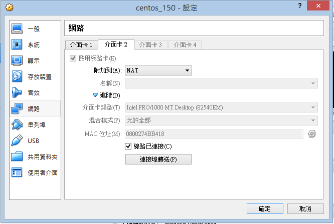
>
> #### 2. Bridge
>
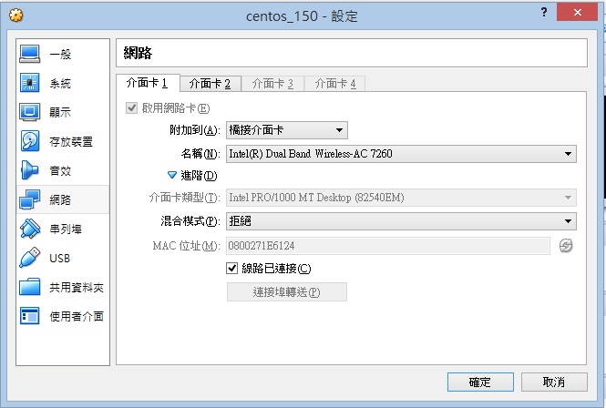

### step 2. Oracle VM Server Setting
> 
> My VM Server OS is centos
>
> Please follow below command
>
```
nmtui
```
>
> Choose `Edit a connection`
>
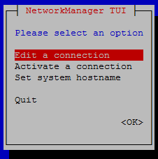
>
> Choose One of Ethernet Connection 
>
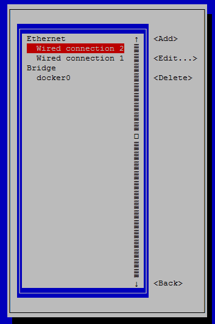
>
> Remember to key space to enable `Automatically Connet` and `Available to all users`
>
> Below is my `Wired connection 2` 、 `Wired connection 1` and `docker0` setting
>
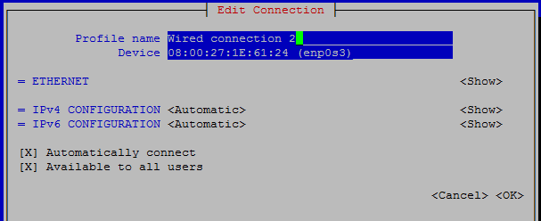
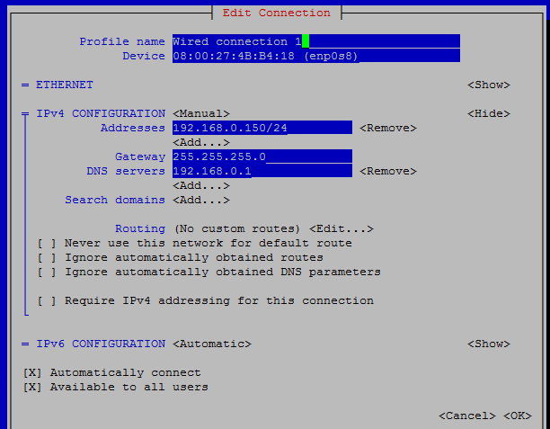
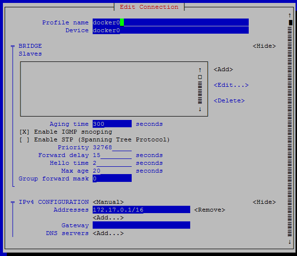
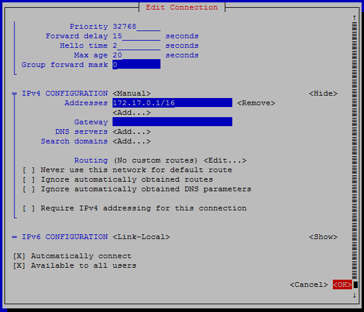
>
> Then, try to key in below command to restart network's setting
>
```
sudo service network restart
```

### step 3. Disable SELinux & Firewall
>
> For some manipulate Convenience reason, we should disable SELinux & Firewall
>
```
# close SELinux
setenforce 0
# close firewall
systemctl stop firewalld.service
# diable firewall
systemctl disable firewalld.service
```

### step 4. Enable vboxsf Setting
> 
> 1. From Virtual Box Perference, choose storage and find the `VBoxGuestAddtions.iso` location
>
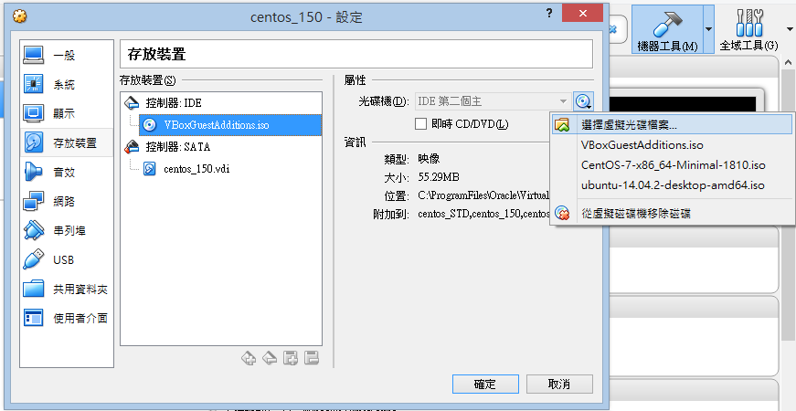
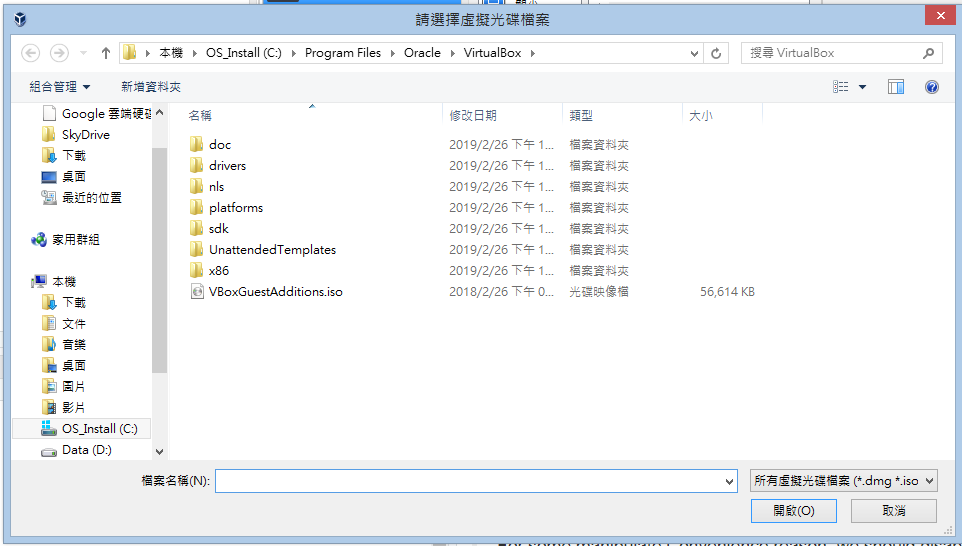
>
> 2. Enter VM Box to mount cdrom as folder
>
```
# create a folder to be mount for cdrom
mkdir /mnt/docker
# mount cdrom as folder
mount /dev/cdrom /mnt/docker
# run vboxsf setting
/mnt/docker/VBoxLinuxAdditions.run
```
>
> 3. Choose Shared Folders and enable below setting
>
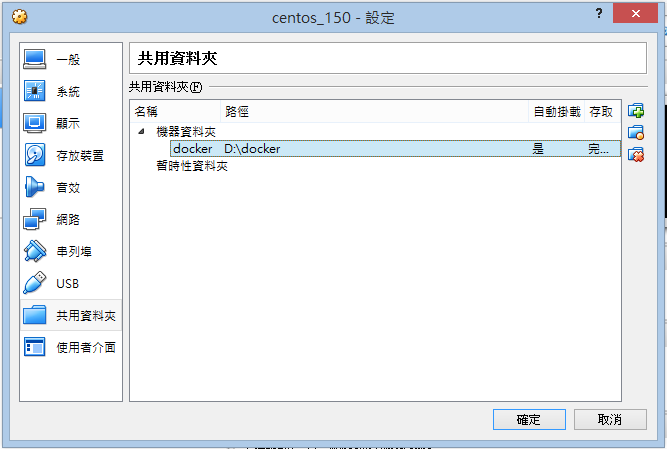
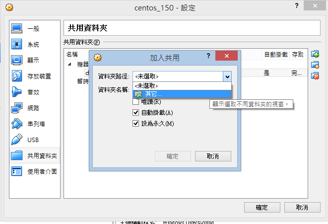
>
> Finally, you will find mount folder at /media/sf_[your mount folder name] `For me, it is /media/sf_docker`
>

